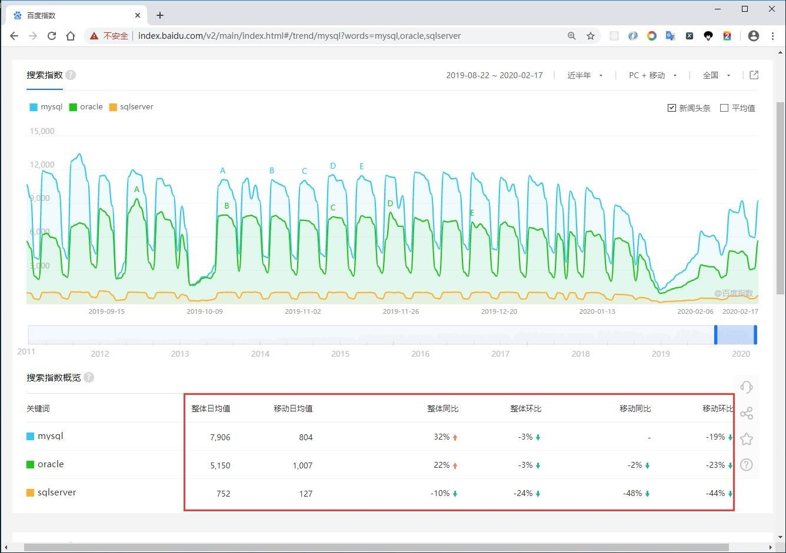

# MySQL 数据库简介

图片来源于网络

## 1. 数据库的概念

数据库是一个长期存储在计算机内的、有组织的、有共享的、统一管理的数据集合。是按照数据结构来组织、存储和管理数据的仓库。目前常用的数据库主要分为**开源 MySQL 数据库**（包括官方版 MySQL、Percona MySQL MariDB）和**商业版数据库** ( 包括 SQL Server、Oracle、DB2 )。

例如一个学校全部学生学籍信息、选课情况、学分统计、考试成绩查询都是利用数据库对学校相关数据进行管理和存储的，而数据库则是配置在学校机房服务器的，利用数据库技术可以对这些数据进行管理，以便于教学工作高效、有序的开展。

而数据库又按照是否采用关系模型划分为两种：

- 关系型数据库
- 非关系型数据库

### 1.1 关系型数据(SQL)

关系型数据库，是指**采用了关系模型来组织数据的数据库**，从语言功能层面来讲,一般是指用 SQL 语言来进行操作管理的关系型数据库。常用的关系型数据库有 MySQL、Oracle、SQLServer、PostGreSQL。

### 1.2 非关系型数据库(NoSQL)

NoSQL 通常指的是 **non-relational** ，也可以理解为 **Not Only SQL**，泛指非关系型数据库。常见的非关系型数据库有 MongDB、HBase、Redis。

### 1.3 新型数据库(NewSQL)

NewSQL 是对各种**新的可扩展/高性能数据库的简称**，这类数据库不仅具有 NoSQL 对海量数据的存储管理能力，还保持了传统数据库支持 ACID 和 SQL 等特性。常见的 NewSQL 有 Google Spanner/F1、阿里 OceanBase、腾讯 TDSQL、TiDB、Cockroach。

## 2. MySQL 发展历史

- **1979 年**，MySQL 的历史最早可以追溯到 1979 年，有一个人叫 Monty Widenius 在一个名为 TcX 的小公司打工并用 BASIC 设计了一个报表工具，可以在 4M 主频和 16KB 内存的计算机上运行。过了不久，又将此工具使用 C 语言重写，移植到 Unix 平台，当时，它只是一个很底层的面向报表的存储引擎；
- **1996 年**，MySQL 1.0 发布，只面向一小拨人，相当于内部发布。到了 96 年 10 月，MySQL 3.11.1 发布了；
- 1999 - 2000 年，有一家公司在瑞典成立了，叫 MySQL AB （AB 是瑞典语“股份公司”的意思）。 雇了几个人,与 Sleepycat 合作，开发出了 Berkeley DB 引擎, 因为 BDB 支持事务处理，所以，MySQL 从此开始支持事务处理了；
- **2000 年 4 月**，MySQL 对旧的存储引擎进行了整理，命名为 MyISAM。同时，2001 年，Heikiki Tuuri 向 MySQL 提出建议，希望能集成他们的存储引擎 InnoDB ，这个引擎同样支持事务处理，还支持行级锁；
- **2004 年 10 月**，发布了经典的 4.1 版本。 2005 年 10 月，有发布了里程碑的一个版本，MySQL 5.0. 在5.0 中加入了游标，存储过程，触发器，视图和事务的支持。在 5.0 之后的版本里，MySQL 明确地表现出迈向高性能数据库的发展步伐；
- **2011 年 4 月**，MySQL 5.6 发布，作为被 Oracle 收购后，第一个正式发布并做了大量变更的版本（5.5版本主要是对社区开发的功能的集成），对复制模式，优化器等做了大量的变更，其中最重要的主从 GTID 复制模式，大大降低了 MySQL 高可用操作的复杂性；
- **2016 年 9 月**，Oracle 决定跳过 MySQL 5.x 命名系列，并抛弃之前的 MySQL 6，7 两个分支（6，7 是两个从来没有对外发布的两个分支），直接进入 MySQL 8 版本命名，自此正式进入 MySQL 8.0 时代。

## 3. MySQL 与同类型数据库对比

### 3.1 MySQL优缺点

#### MySQL优点:

- **运行速度快**：MySQL 体积小，命令执行的速度快；
- **使用成本低**：MySQL 是开源的，且提供免费版本，对大多数用户来说大大降低了使用成本；
- **使用容易**：与其他大型数据库的设置和管理相比，其复杂程度较低，易于使用；
- **可移植性强**：MySQL 能够运行与多种系统平台上，如 Windouws，Linux，Unix 等；
- **适用更多用户**：MySQL 支持最常用的数据管理功能，适用于中小型企业甚至大型网站应用。

#### MySQL 缺点:

- MySQL 最大的缺点是其安全系统，主要是复杂而非标准，另外只有到调用 mysqladmin 来重读用户权限时才发生改变；
- MySQL 没有一种存储过程（Stored ProcedureStored Procedure）语言，这是对习惯于企业级数据库的程序员的最大限制；
- MySQL不支持热备份；
- MySQL 的另一个主要的缺陷之一是缺乏标准的 RI（Referential Integrity-RI）机制；Rl 限制的缺乏（在给定字段域上的一种固定的范围限制）可以通过大量的数据类型来补偿；
- MySQL 的价格随平台和安装方式变化。Linux 的 MySQL 如果由用户自己或系统管理员而不是第三方安装则是免费的，第三方安装则必须付许可费。Unix 或 Linux 自行安装是免费的，Unix 或 Linux 第三方安装则需花费 200 美元。

### 3.2 Oracle 优缺点

#### Orace 优点:

- **开放性**：Oracle 能在大部分主流平台上运行（包括 Windows）完全支持所有工业标准采用完全开放策略使客户选择适合解决方案对开发商全力支持；
- **安全性**：获得最高认证级别的 ISO 标准认证；
- **Oracle 性能高**：保持开放平台下 TPC-D 和 TPC-C 世界记录；
- **客户端支持及应用模式**：Oracle 多层次网络计算支持多种工业标准用 ODBC、JDBC、OCI 等网络客户连接；
- **使用风险**：Oracle 长时间开发经验完全向下兼容得广泛应用地风险低。

#### Oracle 缺点:

- 对硬件的要求很高；
- 价格比较昂贵；
- 管理维护麻烦一些；
- 操作比较复杂，需要技术含量较高。

### 3.3 SQLServer 优缺点

#### SQLServer 优点：

- **易用性**：适合分布式组织的可伸缩性、用于决策支持的数据仓库功能、与许多其他服务器软件紧密关联的集成性、良好的性价比等；
- **数据管理与分析带来了灵活性**：允许单位在快速变化的环境中从容响应，从而获得竞争优势。从数据管理和分析角度看，将原始数据转化为商业智能和充分利用 Web 带来的机会非常重要；
- **完备的数据库和数据分析包**：SQLServer 为快速开发新一代企业级商业应用程序、为企业赢得核心竞争优势打开了胜利之门；
- **基准测试可伸缩性和速度奖的记录保持者**：SQLServer 是一个具备完全 Web 支持的数据库产品，提供了对可扩展标记语言（XML）的核心支持以及在 Internet 上和防火墙外进行查询的能力；

#### SQLServer 缺点：

- **伸缩性并行性**：SQL server 并行实施和共存模型并成熟难处理日益增多用户数和数据卷伸缩性有限。
- **安全性**：没有获得任何安全证书；
- **性能** ：SQL Server 多用户时性能佳 ；
- **客户端支持及应用模式**： 客户端支持及应用模式。只支持 C/S 模式，SQL Server C/S 结构只支持 Windows 客户用 ADO、DAO、OLEDB、ODBC连接；
- **使用风险**：SQL server 完全重写代码经历了长期测试断延迟许多功能需要时间来证明并十分兼容。

### 3.4 MySQL 的市场占比

我们分别在百度指数中查询 MySQL，Oracle，和 SQLSever 这三种关系型数据库的近半年的平均指数，可以看到 MySQL 数据库已经远超同济！

## 4、MySQL 的版本

MySQL 分为**官方版 Mysql**、**MariaDB 社区版**、**Percona 企业版**，其中官方原版高负载性能一般，兼容性好，MariaDB 继续开源,高负载性能较好，兼容性一般。如图对比， Percona 企业版高负载性能最好，兼容性好。

Percona 版的 MySQL 是 Percona 公司对原版 MySQL 进行性能优化之后再发布的版本，其性能比官方原版好，但是 Percona 版的 MySQL 发布一般要晚于官方原版 MySQL 几个月。在企业生产环境中,一般推荐使用 Percona 版的 MySQL，对于新手而言，本套教程中则使用 MySQL 官方目前最新版本 MySQL8.0。

## 5. 为什么要学习 MySQL？

随着互联网技术迅猛的发展，“LNMPR” 一词被越来越多的人熟悉，其中 “L”、“N”、“M”、“P”、“R"分别代表 “Linux”、“Nginx”、“MySQL”、PHP”、“Redis”，而 LNMPR 是后端开发工程师必备技能，学习 LNMPR 相关技术也是各大后端开发工程师提升自己竞争力的有效途径，而 MySQL 作为各大互联网企业重要的数据存储、管理技术，MySQL 数据库工程师的需求也越来越急迫，特别是对有经验的优秀人才需求量巨大。

## 6. 学习基础

学习本套教程之前您需要先了解以下几点：

- 了解一些基础的 Linux 命令；
- 需要安装数据库连接操作工具，如 Navicat。