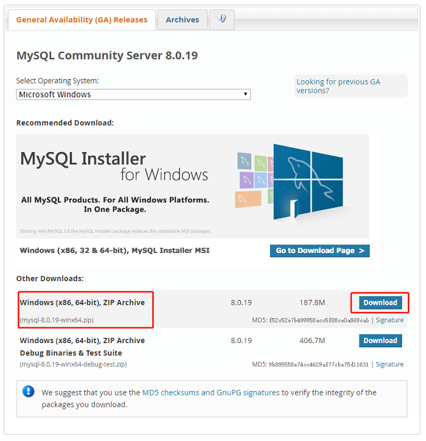
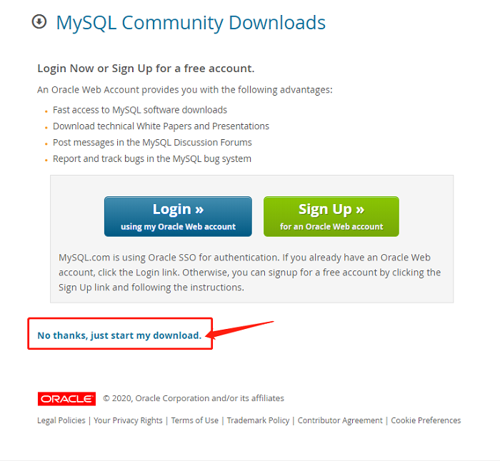
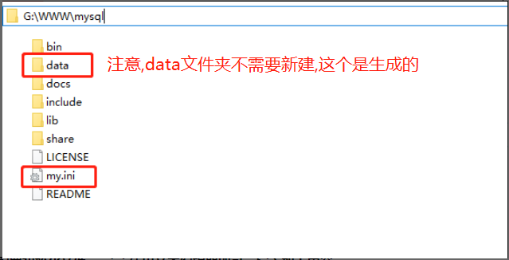
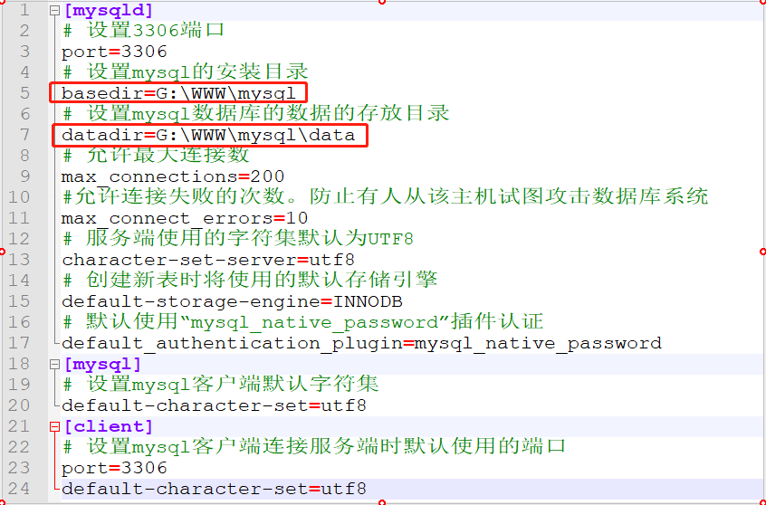
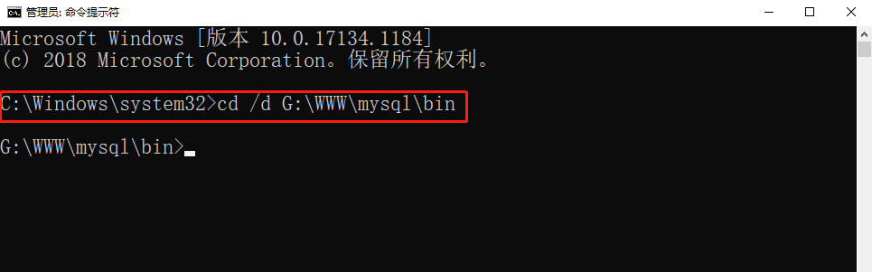
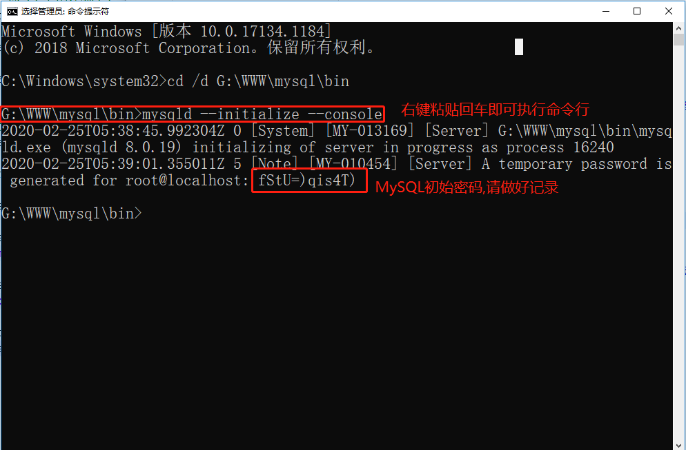
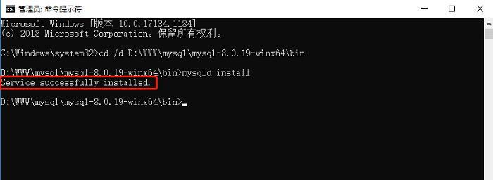
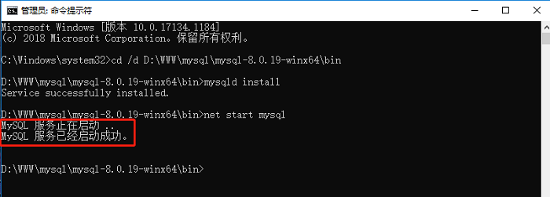
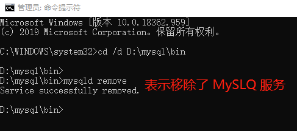

# Windows下安装最新版MySQL

本节课的目的在 Windows 下安装 MySQL 数据库，步骤比较简单，直接去官网下载安装包然后解压进行编译即可。


## 1. 下载 MySQL

**1.1 来到[官网](https://dev.mysql.com/downloads/mysql/)下载 Windows 版本 MySQL 压缩包，如图所示选择 Windows 版本的安装包并下载**：



**1.2 点击下载之后会提示让你登录，如图所示。选择不用登陆，直接下载即可**：




## 2. 安装 MySQL

**2.1 解压下载好的 .zip 文件到需要的安装目录下，如"G:\WWW\mysql"，并新建空文件 my.ini 文件如下图**：



**2.2 配置初始化文件 my.ini 使用文本编辑器即可，写入如下内容**：

```sql
[mysqld]
# 设置3306端口
port=3306
# 设置mysql的安装目录
basedir=G:\WWW\mysql
# 设置mysql数据库的数据的存放目录
datadir=G:\WWW\mysql\data  
# 允许最大连接数
max_connections=200
#允许连接失败的次数。防止有人从该主机试图攻击数据库系统
max_connect_errors=10
# 服务端使用的字符集默认为UTF8
character-set-server=utf8
# 创建新表时将使用的默认存储引擎
default-storage-engine=INNODB
# 默认使用“mysql_native_password”插件认证
default_authentication_plugin=mysql_native_password
[mysql]
# 设置mysql客户端默认字符集
default-character-set=utf8
[client]
# 设置mysql客户端连接服务端时默认使用的端口
port=3306
default-character-set=utf8
代码块123456789101112131415161718192021222324
```

如下图所示:



**2.3 初始化 MySQL，点击桌面开始搜索 cmd，右键以管理员身份运行 cmd ,进入 bin 目录，进入 bin 目录命令:**

```bash
 命令 : cd /d G:\WWW\mysql\bin
代码块1
```

打开的 cmd 命令行窗口如下图，请注意当前目录在 bin 目录下：



执行以下命令（可直接复制右键粘贴，回车）：

```bash
命令 : mysqld --initialize --console #初始化MySQL环境,需耐心等待几分钟
代码块1
```

> Tips：若出现 `无法启动此程序,因为计算机中丢失vcruntime140..` 错误提示，表示你的计算机需要安装 `VC++` 依赖程序，百度网盘下载地址: `https://pan.baidu.com/s/1__hMI5bC6HhiPJSUrRE36A 提取码：m4kw`，安装后重启电脑即可。

跟在 `root@localhost:` 后面的为初始化密码，需要记录一下，如图所示：



安装 MySQL 服务:

```bash
 命令 : mysqld install
代码块1
```

出现如下图所示表示安装成功：


**2.4 关闭和启动 MySQL （注意在 Windows 启动 MySQL 之前需操作第 5 步），在 bin 目录下执行如下命令：**

```sql
 命令 : net start mysql # 启动命令

 命令 : net stop mysql # 关闭命令
代码块123
```

出现如图所示输出，说明 MySQL 服务已经启动成功：




## 3.卸载 MySQL

Windows 下使用源码安装方式，卸载时需要删除源码包文件夹，然后卸载 MySQL 的服务即可：

```bash
 命令 : cd /d G:\WWW\mysql\bin

 命令 : mysqld remove
代码块123
```

如下图所示:


> **Tips**：MySQL 服务可以在 Windows 的服务管理界面看到，若小伙伴是用 MySQL 安装包安装的，可能改变了系统的注册表，会出现卸载不干净的情况，可以选择 360 或者 电脑管家等软件去卸载。


## 4. 视频演示安装过程

<video src="02 Windows下安装最新版MySQL.assets/mysql_windows_install.mp4"></video>


## 5. 小结

本节课我们学习了如何在 Windows 下安装 MySQL 数据库，Windows 下的安装过程步骤比较多，大家一定要多多注意不要输错了命令，下一个小节我们来学习下如何在 Linux 下安装 MySQL 数据库。