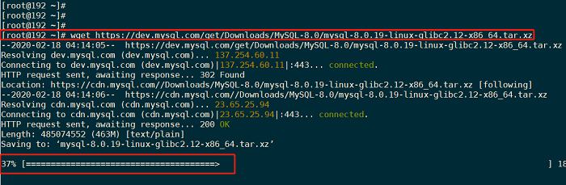
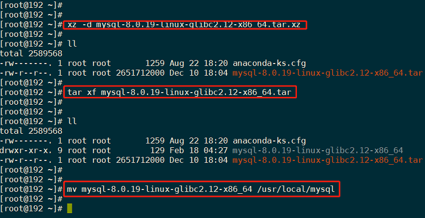
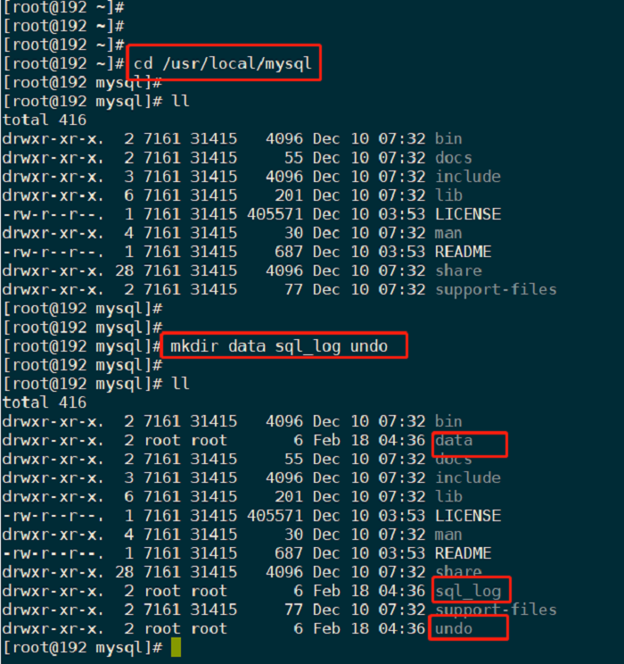
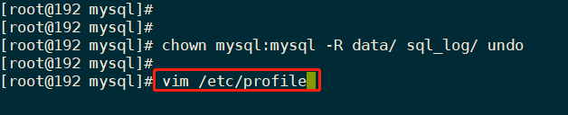
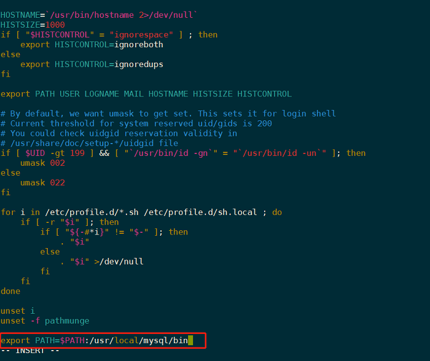
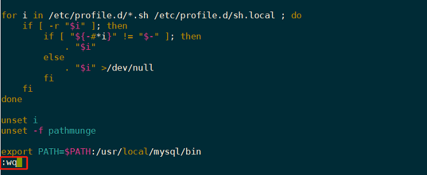
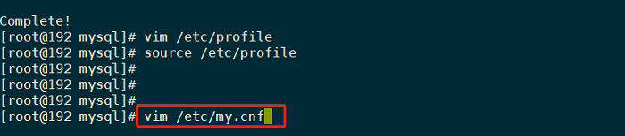
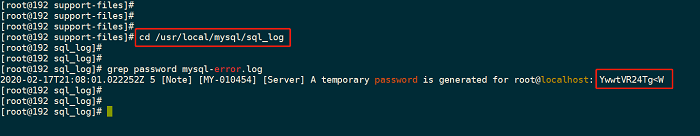
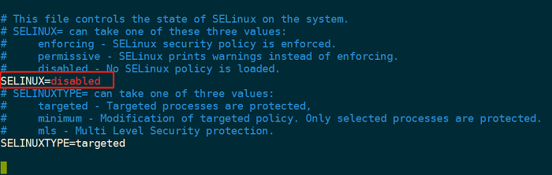

# Linux 下安装最新版 MySQL

上一节我们学习了在 Windows 下安装 MySQL 数据库，这节课我们来学习在 Linux 操作系统下安装 MySQL 8.0 版本的数据库。这节课我们使用 Linux 的 CentOS 发行版本来进行操作讲解。


## 1. 下载和安装 MySQL


### 1.1 下载 Linux 版本 MySQL 压缩包

在 Linux 操作系统中下载 MySQL 比较简单，只需要运行一条命令就可以了。

```shell
命令 : wget https://dev.mysql.com/get/Downloads/MySQL-8.0/mysql-8.0.19-linux-glibc2.12-x86_64.tar.xz  # 下载地址
代码块1
```

下载进度如图所示：




### 1.2 解压下载好的压缩包

```bash
命令 : xz -d mysql-8.0.19-linux-glibc2.12-x86_64.tar.xz
#将.xz压缩包解压为.tar

命令 : tar xf mysql-8.0.19-linux-glibc2.12-x86_64.tar
#将.tar压缩包解压为文件夹

命令 : mv mysql-8.0.19-linux-glibc2.12-x86_64 /usr/local/mysql/
#移动至安装目录,这里是 /usr/local/mysql
代码块12345678
```

操作流程如图：



给MySQL建立系统账号：

```
 命令 : adduser mysql
代码块1
```


### 1.3 新建 data、sql_log、undo 目录

进入 MySQL 安装目录：

```
 命令 : cd /usr/local/mysql
代码块1
```

新建data、sql_log、undo目录：

```
 命令 : mkdir data sql_log undo
代码块1
```

给这三个目录建立属主：

```
 命令 : chown mysql:mysql -R data/ sql_log/ undo
代码块1
```

如图所示：




### 1.4 添加 MySQL 环境变量

```
 命令 : vim /etc/profile
代码块1
```



在 profile 文件末尾添加如下内容（按 i 编辑）：

```bash
export PATH=$PATH:/usr/local/mysql/bin
代码块1
```

如下图所示:



按 ESC，然后输入 `:wq` 保存退出,如图所示:



使上述配置生效:

```bash
 命令 : source /etc/profile
代码块1
```


## 2. 在 Linux 上配置 MySQL


### 2.1 新建 MySQL 配置文件

新建 my.cnf 配置文件：

```shell
 命令 : vim /etc/my.cnf
代码块1
```

在 my.cnf 中添加如下内容：

```sql
在my.cnf中添加如下内容:
[mysqld]
# 设置3306端口
port=3306
# 设置mysql的安装目录
basedir=/usr/local/mysql
# 设置mysql数据库的数据的存放目录
datadir=/usr/local/mysql/data
# 允许最大连接数
max_connections=200
#允许连接失败的次数。防止有人从该主机试图攻击数据库系统
max_connect_errors=10
# 服务端使用的字符集默认为UTF8
character-set-server=utf8
# 创建新表时将使用的默认存储引擎
default-storage-engine=INNODB
# 默认使用“mysql_native_password”插件认证
default_authentication_plugin=mysql_native_password
[mysql]
# 设置mysql客户端默认字符集
default-character-set=utf8
[client]
# 设置mysql客户端连接服务端时默认使用的端口
port=3306
default-character-set=utf8
代码块12345678910111213141516171819202122232425
```

如图所示 :




### 2.2 初始化 MySQL

进入 MySQL 安装目录：

```shell
 命令 : cd /usr/local/mysql
代码块1
```

执行初始化:

```shell
 命令 : mysqld --initialize --user=mysql --basedir=/usr/local/mysql --datadir=/usr/local/mysql/data # 过程较慢，需要耐心等待
代码块1
```

> **Tips**：在初始化过程中如果出现以下输出：
>
> ```bash
> mysqld: error while loading shared libraries: libnuma.so.1: cannot open shared object file: No such file or directory,可以使用命令:
> 代码块1
> ```
>
> 可以使用命令 `yum -y install numactl` 来解决。
>
> 出现这个错误是因为 Linux 缺少软件依赖包 numactl，上述命令时通过 yum 仓库安装 numactl 依赖包。


### 2.3 查询 MySQL 初始临时密码

进入 `/usr/local/mysql/sql_log`，使用如下命令可查看初始临时密码，请做好相关记录，后面登录需要用到：

```shell
 命令 : cd /usr/local/mysql/sql_log

 命令 : grep password mysql-error.log
代码块123
```

如图所示 :




### 2.4 关闭 Linux 防火墙

新手在安装学习 MySQL ，通常会出现端口号被防火墙阻止了，从而一直接连不上 MySQL 所以为了方便后面连接 MySQL 学习，可以关闭 Linux 防火墙：

```shell
  命令 : systemctl status firewalld
  #查看防火状态
  
  命令 : systemctl disable firewalld
  #关闭防火墙
代码块12345
```


### 2.5 关闭 selinux

SELinux （Security-Enhanced Linux）是美国国家安全局（NSA）对于强制访问控制设计的一个安全系统，但其对很多软件比较敏感，会导致很多服务崩溃，所以建议关闭：
编辑 selinux 配置文件:

```shell
  命令 :vim /etc/selinux/config
代码块1
```

将 selinux 中参数改为 `SELINUX=disabled`，按 ESC，输入 `:wq` 保存退出,并使配置立即生效

```shell
  命令 : source /etc/selinux/config 
代码块1
```

将其中参数改为 `SELINUX=disabled` ，并使配置立即生效

```shell
  命令 : source /etc/selinux/config   
代码块1
```

如图所示:




### 2.6 启动、停止、重启 MySQL

进入 `/usr/local/mysql/support-files` 操作命令：

```bash
 命令 : cd /usr/local/mysql/support-files
 
 命令 : cp mysql.server /etc/init.d/mysql.d
代码块123
```

MySQL 服务命令 :

```bash
 命令 : service mysqld start 
 #MySQL 服务启动(这里是注释,#后面都是)
 
 命令 : service mysqld stop
 #MySQL 服务停止
 
 命令 : service mysqld reload
 #MySQL 服务重启
代码块12345678
```


## 3. 视频演示安装过程

<video src="https://v3.mukewang.com/5f3603c7422b1a10ac1db7f1/S.mp4"></video>


## 4. 小结

这个小节我们在 Linux 的 CentOS 发行版本上安装了 MySQL数据库，过程和在 Windows 上安装差不多。需要注意的是在安装完成之后需要关闭 Linux 操作系统自身的防火墙和 SELinux 安全系统，会避免很多不必要的麻烦，以后的学习会更加顺畅。